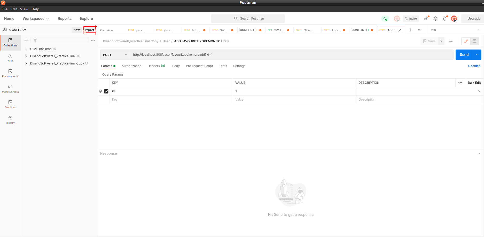
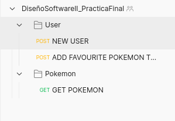

# Reto Pokémon: Parte individual - Miquel Jordà Lopez

---
## Pre-requisitos

* Tener Java 11 instalado
* Tener docker instalado
* Comprobar los permisos del fichero gradlew (este fichero se encuentra en la raíz del proyecto, y es lo que se emplea para lanzar la aplicación).
  Es muy probable que la terminal muestre que no tenemos permisos para ejecutarlo, por lo que habrá que cambiarlos mediante `chmod u+x gradlew`
* Tener algún programa como Postman (la parte de la API no es necesario probarla con Postman, pero este tipo de programas hace que dicha labor sea más sencilla por la interfaz visual de este tipo de aplicaciones como Postman)

---
## Preparación
### Puesta en marcha de RabbitMQ

1) Primero habrá que pullear la imagen docker de RabbitMQ. Ejecutar en consola el siguiente comando:
```
docker pull rabbitmq:management
```
2) Una vez se haya descargado la imagen, habrá que iniciar el contenedor exponiendo los puertos necesarios. Ejecutar el siguiente comando:
```
docker run --name=rabbitmq -p 5672:5672 -p 15672:15672 rabbitmq:management
```
3) Para comprobar que el contenedor está correctamente en marcha, ir al siguiente link y verificar que el portal de
RabbitMQ está activo http://localhost:15672. Las credenciales son **guest** y **guest** para usuario y contraseña respectivamente.
   
### Puesta en marcha de la aplicación

1) Para construir la aplicación, ejecutar 
   ```
   ./gradlew clean build
   ```
2) Para lanzar la aplicación, ejecutar 
   ```
   java -jar build/mdas-web-miquel-jorda-1.0-SNAPSHOT-runner.jar
   ```
---
## Parar la aplicación

La aplicación se podrá parar por completo pulsando la combinación de teclas CTRL+C

---
## Ejecutar los test

A pesar de que los tests se ejecutan en el momento de ejecutar el comando `./gradlew build`, también se pueden
ejecutar mediante el comando `./gradlew test`.

---
## Probar la aplicación

La aplicación se puede usar haciendo peticiones http, usando por ejemplo ***Postman*** o ***cURL***.
A continuación se detallarán los pasos a seguir para probarlo con dicha aplicación, y en el siguiente apartado se podrán
obtener las peticiones ***cURL*** por si se quieren usar en lugar de ***Postman***:
### ***Postman***
#### 1. Abrir *Postman*
#### 2. Clicar en el botón ***importar***
En la siguiente imagen se detalla dónde encontrar dicho botón:

#### 3. Seleccionar la [colección de postman](./src/main/resources/DiseñoSoftwareII_PracticaFinal.postman_collection.json) *(src/main/resources)*
Una vez hecho este paso, debería de aparecer una colección como se puede apreciar en la imagen a continuación:

#### 4. Ejecutar la petición `NEW USER`
Esta petición tiene dos parámetros, los cuales corresponden al nombre y a la id del ***usuario*** que se quiere crear.
#### 5. Ejecutar la petición `ADD FAVOURITE POKEMON TO USER`
Esta petición tiene un parámetro, el cual pertenece a la ***id del pokemon*** al cual se hace referencia. Por otro lado, 
tiene un parámetro *header* que hace referencia a la ***id del usuario*** al cual se quiere vincular dicho pokemon.
#### 6. Ejecutar la petición `GET POKEMON`
Esta petición tiene un parámetro en la query el cual hace referencia a la ***id del pokemon*** el cual queremos recuperar.

---
### ***Curl***
A continuación se detallan las peticiones ***cURL***. En el caso que se quieran usar, habrá que hacerlas en el mismo orden
tal cual aparecen. Lo descrito en el punto anterior (*Postman*) aplica a estas peticiones.
#### Create User
```
curl --location --request POST 'http://localhost:8081/user/add?name=Alba&userId=1'
```
#### Add Favourite Pokemon to User
```
curl --location --request POST 'http://localhost:8081/user/favouritepokemon/add?id=3' --header 'id: 1'
```
#### Get Pokemon
```
curl --location --request GET 'http://localhost:8081/pokemon/get/3'
```

---
>NOTA:
>Si se quiere probar el caso de añadir múltiples veces un mismo Pokemon como favorito, se deberá crear múltiples usuarios y
> añadir las veces deseadas dicho Pokemon, teniendo en cuenta que como máximo se podrá añadir una vez por usuario.

>NOTA:
> Las peticiones de la colección se pueden llamar con distintos parámetros para probar lo que haga falta en referencia a 
> la aplicación.